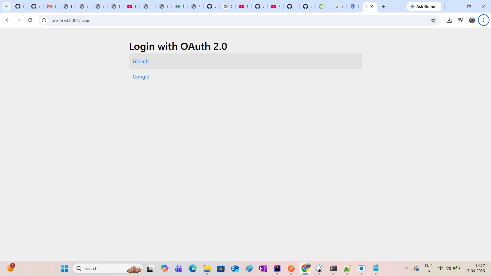
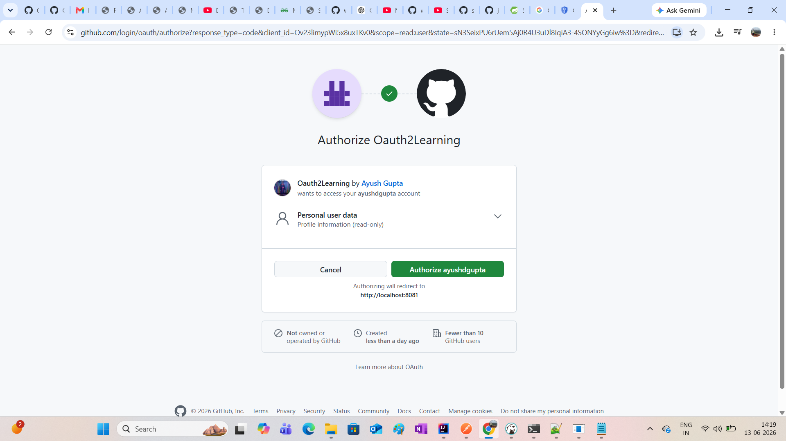
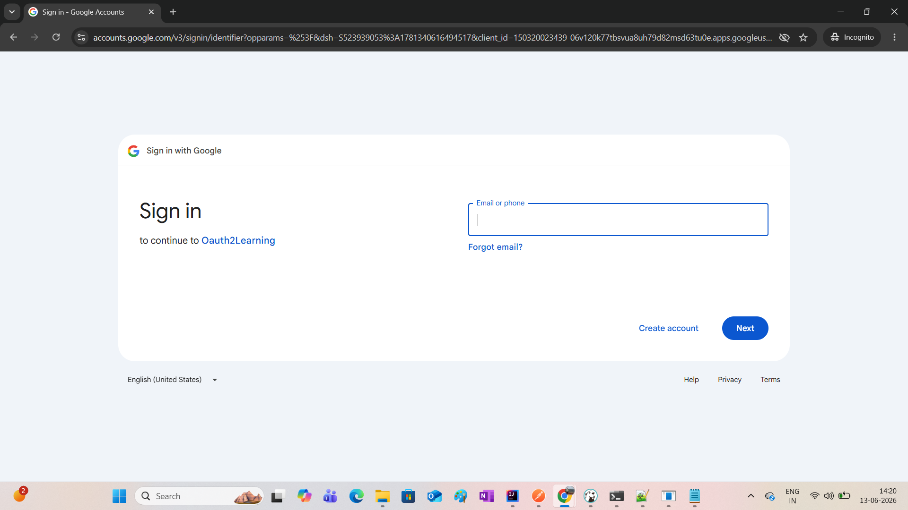

## final url
http://localhost:8081/swagger-ui/index.html    
http://localhost:8081/userController/getUser

### Github call back url
http://localhost:8081/login/oauth2/code/github

### google call back url
http://localhost:8080/login/oauth2/code/google

### steps to get creds from google
https://spring.io/guides/tutorials/spring-boot-oauth2
https://developers.google.com/identity/openid-connect/openid-connect

### Final result

